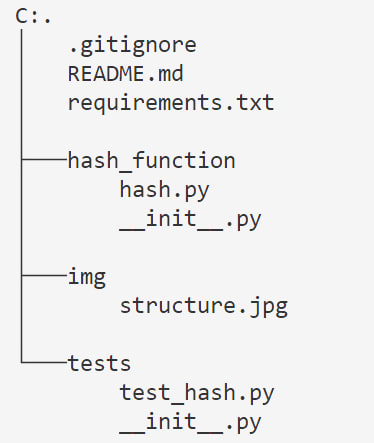

# Описание:
Данный учебный проект реализует хэш-функцию, которая принимает массив байт произвольной длины и возвращает массив байт длины 32.

Хэш-функция - это функция, преобразующая произвольный массив данных в строку фикисированной длины. Строка представляет собой набор байтов и зависит от используемого алгоритма, в случае этого проекта, 32 байта.

Для реализации практического смысла проекта на ввод будут приниматься придуманный пользователем email, который будет пропускаться через хэш-функцию, а затем значение хэша будет добавляться в БД (базу данных), в данном проекте -- в список.

Так как данный проект подразумевает некриптографическую хэш-функцию, которая возвращает слишком короткую последовательность байтов, она может быть полезна для приложений, где важна уникальность значений, но безопасность не стоит на первом месте. Важно отметить, что такая хэш-функция не гарантирует отсутствие коллизий, что может быть критично в системах, требующих высокой степени защиты данных. Тем не менее, данный подход идеально подходит для обучения принципам хэширования и создания простых приложений, не связанных с обработкой чувствительной информации.

В будущем проект можно расширить, добавив возможность работы с различными типами данных (например, паролями или сообщениями) и улучшить хэш-функцию, чтобы она стала более стойкой к коллизиям, используя дополнительные методы обработки данных.

## Структура:

tree /F

## Запуск тестов:

> pip install -r requirements.txt
> python -m unittest tests/test_hash.py

## Запуск основного скрипта:

> python main.py